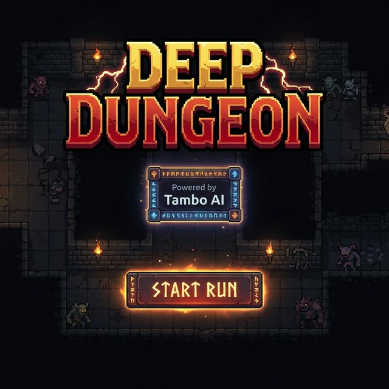
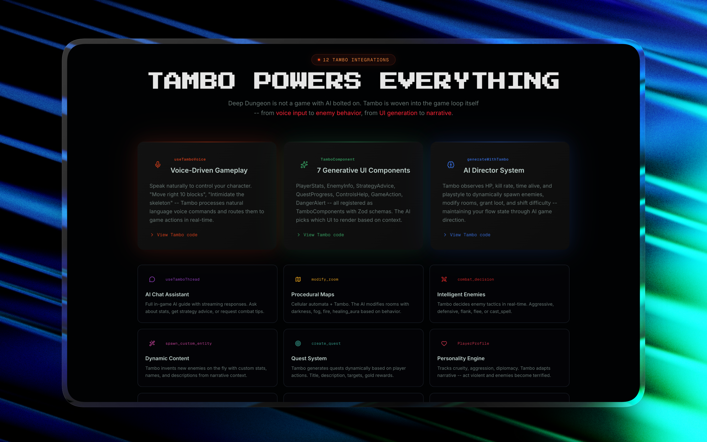
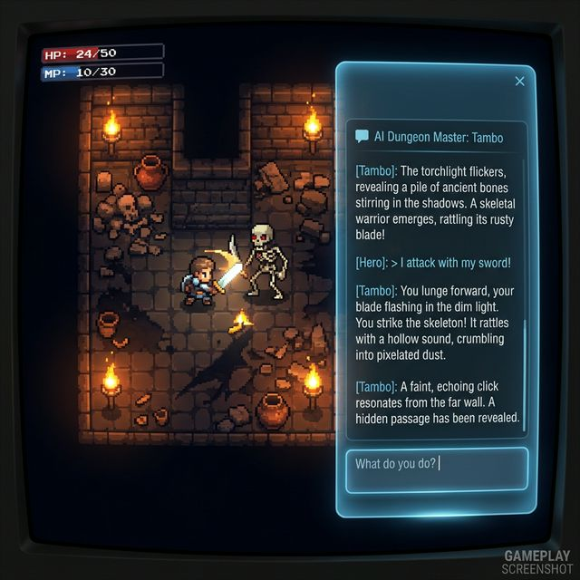
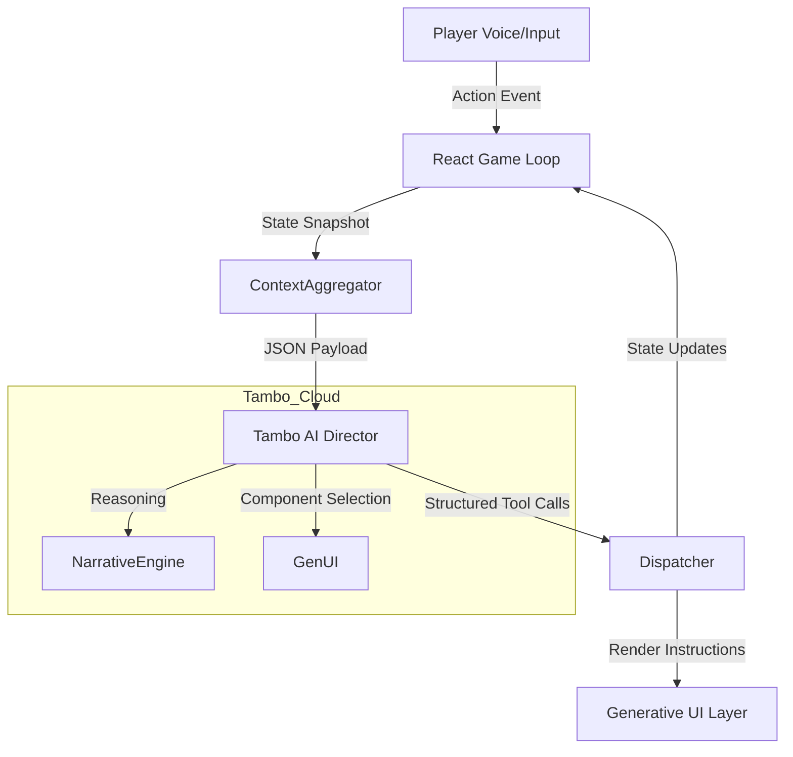

<div align="center">

# Deep Dungeon

## **An AI-Native Roguelike Powered by Tambo Agentic Intelligence**

[Play Demo](https://play-dungeon.samarthsaxena.dev/)

</div>

Deep Dungeon represents a paradigm shift in game development, moving beyond static scripts to a fully dynamic, agentic game loop. By integrating **Tambo** directly into the core engine, The game features a Dungeon Master that doesn't just respond to commands but actively innovates—generating levels, crafting narratives, and improvising gameplay mechanics in real-time.

<div align="center">
  
</div>

---

## The Problem
Traditional RPGs and roguelikes are bound by finite content constraints:
*   **Static Interactions**: NPCs rely on pre-written dialogue trees that exhaust quickly.
*   **Predictable Loops**: Enemies follow rigid state machines, making repeated playthroughs rote.
*   **Disconnected UI**: User interfaces are hard-coded and cannot adapt contextually to the player's unique narrative journey.

## The Solution
Deep Dungeon replaces the static game master with an **Agentic AI Director**. The game state is continuously observed by Tambo, which hallucinates new content, modifies the game rules, and performs **Generative UI** updates to match the narrative context.

<div align="center">
  
  <p><em>In-Game View: Tambo Use Cases</em></p>
</div>

---

## Real-World Feasibility: Beyond Games
This project serves as a proof-of-concept for **Tambo's Agentic Capabilities** in serious industries. The same engine driving Deep Dungeon can be adapted for:

*   **Gamified Education**: Instead of a dungeon, imagine a **History Class** where the AI Director roleplays as historical figures (e.g., "Negotiate with Julius Caesar"). The system adapts the difficulty and "quest" (learning objective) based on the student's responses, making history alive and interactive.
*   **Corporate Training Simulations**: A "Sales Dungeon" where the AI generates infinite, unique customer scenarios. It analyzes the user's pitch strategy (Aggressive vs. Consultative) and provides real-time feedback via the HUD, training employees in a safe, risk-free environment.
*   **Narrative Therapy Support**: A resilience training tool where the "Dungeon Master" acts as a supportive guide, helping users navigate metaphorical challenges. The system can adapt scenarios to help users practice emotional regulation and problem-solving in a controlled narrative space.

---

## Use Case: Generative UI
**Powered by Tambo SDK**

This is not a simple chat interface. Deep Dungeon utilizes Tambo's Generative UI capabilities to render interface elements that were not explicitly programmed for a specific scene.
*   **Context-Aware Components**: If the player encounters a merchant, the AI Director generates a trading interface. If they find a complex puzzle, a custom keypad or rune-lock UI appears instantly.
*   **Dynamic Feedback**: The Heads-Up Display (HUD) adapts to the "mood" of the dungeon, shifting visual styles and information density based on the AI Director's current theme (e.g., shifting from "High Fantasy" to "Eldritch Horror").

<div align="center">
  
  <p><em>In-Game View: Retro pixel art meets Agentic UI</em></p>
</div>

## Use Case: Voice-Native Gameplay
The game is architected for natural language as a primary input method. Players do not just press buttons; they speak to the world.
*   **Intent Recognition**: Natural language commands like "I want to sneak past the guard and steal his key" are parsed into specific game logic (Stealth Check + Loot Action) combined with Narrative Flavor.
*   **Seamless Interaction**: Eliminates the friction of command lines or complex menus. The world reacts to the player's voice in real-time.

## Use Case: Infinite Narrative Engine
The story is procedurally generated at the semantic level, ensuring no two runs are identical.
*   **Adaptive Lore**: The Dungeon Master hallucinates consistent lore that expands as you explore, referencing past actions and entities.
*   **Psychological Profiling**: The AI builds a personality profile of the player based on their actions (e.g., "Aggressive," "Diplomatic," "Explorer") and tailors future encounters to challenge or reward that specific playstyle.

---

## Technical Architecture

Deep Dungeon implements a novel **Hybrid Neuro-Symbolic Game Loop**.



### The Director System
The AI Director (Tambo) operates on a parallel "Reasoning Loop" separate from the frame-rate loop:
1.  **Observe**: Monitors player health, inventory, and recent semantic actions.
2.  **Analyze**: Determines the dramatic pacing (e.g., "Player is bored, spawn a boss" or "Player is weak, offer a health potion").
3.  **Act**: Executes proprietary tool calls (`spawn_entity`, `modify_room`, `trigger_event`) to mutate the client-side state directly.

---

## Getting Started

### Prerequisites
*   Node.js 18+
*   Tambo API Key

### Installation

1.  **Clone the Repository**
    ```bash
    git clone https://github.com/samarthsaxena2004/DeepDungeon.git
    cd DeepDungeon
    ```

2.  **Install Dependencies**
    ```bash
    npm install
    ```

3.  **Configure Environment**
    Create a `.env.local` file in the root directory:
    ```env
    NEXT_PUBLIC_TAMBO_API_KEY=your_api_key_here
    NEXT_PUBLIC_TAMBO_PROJECT_ID=your_project_id
    ```

4.  **Run Development Server**
    ```bash
    npm run dev
    ```
    Open [http://localhost:3000](http://localhost:3000) to enter the dungeon.

---

## Future Roadmap

*   **Multiplayer Mode**: Experimenting with PartyKit so multiple players can share one AI-directed session instead of separate single-player worlds.
*   **Memory Between Runs**: Integration with vector databases to allow the AI Director to remember player actions across different sessions and campaigns.
*   **Custom Personalities**: Expose a simple system to plug in different Dungeon Master styles that reshape narration, difficulty, and rewards.

---

*Built for the WeMakeDevs x Tambo Hackathon by Samarth Saxena.*
