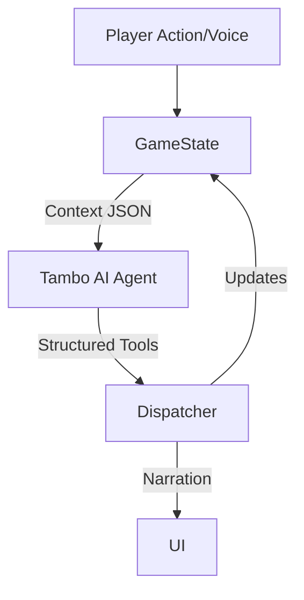

# Deep Dungeon 🏰
**An AI-Native Roguelike Powered by Tambo**

Deep Dungeon is a proof-of-concept roguelike that demonstrates the power of **Agentic AI** in game development. Instead of static scripts, the Dungeon Master is a real-time AI agent (Tambo) that observes the game state, listens to your voice, and generates content on the fly.

## 🧠 The "Tambo" Architecture

Unlike traditional games where AI is just a chatbot on the side, Tambo is integrated directly into the game loop.



### Key Features

*   **🗣️ Voice-Driven Gameplay**: Speak naturally to the Dungeon Master. "I want to intimidate this skeleton!" or "Is there anything hidden in this room?"
*   **🎭 AI Personality**: The DM remembers your playstyle. Act violent? Expect a combat-heavy crawl. Act diplomatic? You might find friends in the dark.
*   **🎲 Real Consequences**:
    *   **Morale System**: Enemies aren't mindless. Hurt them enough, and they might flee looking for self-preservation.
    *   **Social Diplomacy**: Talk your way out of fights. A successful intimidation check can end a battle without a sword swing.
*   **✨ Dynamic Content**: Tambo can invent new enemies (with custom stats and visuals) and generate quests on the fly based on the narrative.

## 🛠️ Technology Stack

*   **Frontend**: Next.js 14, React, Tailwind CSS
*   **Game Engine**: Custom React `useReducer` game loop
*   **AI Brain**: Tambo (Google's Agentic AI)

## 🚀 Getting Started

1.  **Clone the repository**
2.  **Install dependencies**:
    ```bash
    npm install
    ```
3.  **Configure Environment**:
    Create a `.env.local` file with your Tambo API key:
    ```env
    TAMBO_API_KEY=your_key_here
    ```
4.  **Run the game**:
    ```bash
    npm run dev
    ```
    Open [http://localhost:3000](http://localhost:3000) to play.

## 🎮 How to Play

*   **WASD / Arrows**: Move
*   **Space**: Attack
*   **E**: Interact
*   **Microphone**: Hold the mic button (or spacebar in voice mode) to speak to the DM.
